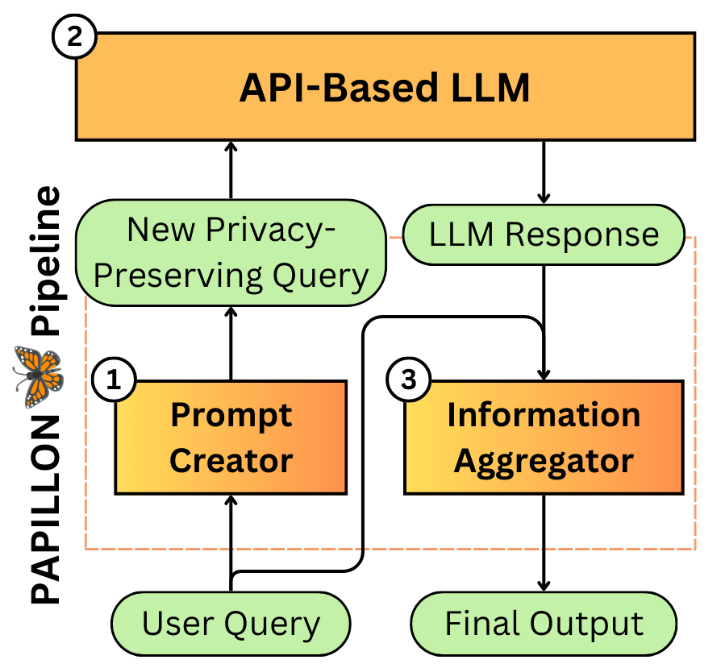

# PAPILLON

PAPILLON is a framework where trusted but weaker models can use untrusted but more powerful models as tools in order to preserve user inference-time privacy.



## TO-DOs

- [ ] Add version of DSPy from the original code base for optimization and inference for reproducibility; currently, PAPILLON is compatible with the newest version of DSPy for inference (interactive mode).
- [x] Complete PUPA data processing code.
- [ ] Add PUPA to Huggingface.
- [ ] Build a Flask server and simple UI for PAPILLON.
- [ ] Make PAPILLON installable via PyPI.


## Installation
We are working on making PAPILLON a PyPI package. Until then, you would unfortunately need to clone the repository first.

To create a conda environment to run PAPILLON in, run the following command:

```
conda create -f environment.yml
conda activate papillon
```

Provide your OpenAI API Key:

```
export OPENAI_API_KEY="<YOUR_OPENAI_API_KEY>"
```

<!-- commit ee8206ea7ce14630b3e64d2b997878169dee3252 -->

## Using PAPILLON

To use the DSPy-optimized PAPILLON pipeline, you would need to do the following:

1. Host your trusted model of choice on a server
2. Supply private user prompts 
3. Run the provided PAPILLON pipeline or optimize new PAPILLON pipelines on new data

We will build a Flask server and UI for PAPILLON for easy use in the future. For now, you would have to manually enter the private user query, or read queries from a CSV file.

You can interact with PAPILLON pipelines directly using the `papillon/run_papillon_interactive.py` script.

### Host Language Models on Server
We currently have optimized PAPILLON prompts for the following models:

- Llama-3.2-1B-Instruct
- Llama-3.2-3B-Instruct
- Llama-3-8B-Instruct
- Llama-3.1-8B-Instruct
- Mistral-7B-Instruct
- Mistral-Small

There are multiple options to host these models. For Llama-3.2, the current official method of hosting is via [VLLM](https://docs.vllm.ai/en/latest/). You can also host the 1B and 3B models on [Ollama](https://ollama.com/library/llama3.2). The other models can be hosted through [SGLang](https://sgl-project.github.io/). Here, we use SGLang as an example:

```
python -m sglang.launch_server --model-path meta-llama/Llama-3.1-8B-Instruct --port <PORT_NUMBER>
```

### Pipeline Optimization
You may use PUPA data or your new data, formatted according to the PUPA format (see `pupa`), to optimize PAPILLON pipelines with different local and API-based model ensembles.

```
cd papillon

python3 run_dspy_optimization_llama.py --port <PORT_NUMBER> --prompt_output "output.json" --data_file "../pupa/PUPA_New.csv"
```

### Evaluating Optimized Pipelines

This will print out the average quality and leakage scores according to the LLM judge defined in `papillon/llm_judge.py`.

```
cd papillon

python3 evaluate_papillon.py --port <PORT_NUMBER> --model_name <MODEL_NAME> (e.g. meta-llama/Llama-3.1-8B-Instruct)
```

### Running PAPILLON Interactively

This script should display a terminal prompt that allows you to type in your user queries manually, and then print out the corresponding PAPILLON-synthesized privacy-preserving prompt and final PAPILLON responses.

```
cd papillon

python3 run_papillon_interactive.py --port <PORT_NUMBER> --model_name <MODEL_NAME>
```

## PUPA Dataset
Please see the `pupa` directory for raw CSV files for **PUPA-TNB** and **PUPA-New** datasets. We are currently working on moving the datasets to Huggingface for easier access.

## Adding New Data
If you have new user-assistant interaction data containing private information and you want to process it to the PUPA data format, you can use code in the `pupa` directory to scaffold this process.

## Citation
```
@article{siyan2024papillon,
  title={PAPILLON: PrivAcy Preservation from Internet-based and Local Language MOdel ENsembles},
  author={Siyan, Li and Raghuram, Vethavikashini Chithrra and Khattab, Omar and Hirschberg, Julia and Yu, Zhou},
  journal={arXiv preprint arXiv:2410.17127},
  year={2024}
}
```
